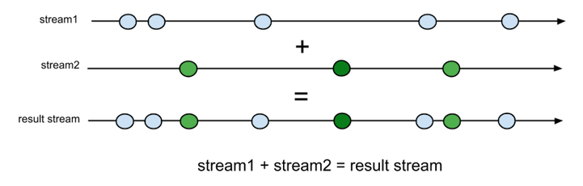

---

layout: default

---

# **{{ site.presentation.title }}** {#cover}

	
{{ site.author.name }},   {{ site.author.position }}

## &nbsp;

* ... Objects & Inheritance
* ... Concurrency model & Event Loop
* ... Asynchronous Programming

## Объекты и наследование
{:.section}

### Objects & Inheritance

## Object

~~~javascript
{
    key1 : value,
    key2 : value2,
}
//...and a bit magic
~~~

* ... key-value pairs
* ... No schema and metadata

~~~javascript
//create empty object
let obj1 = {}; // not really empty
let obj2 = Object.create(Object.prototype);
let obj3 = Object.create(null);
~~~
{:.next}

## Object properties

* ... unique
    * ... coerced to strings
    * ... `Symbol`
        * ... avoids name collision (always unique)
        * ... `Symbol('val') === Symbol('val') //false !!!`
        * ... "hidden" property

* ... dynamic
    * ... add any prop
    * ... remove any prop
    * ... any time

## Object properties

~~~javascript
let obj    = {};
obj['123'] = {a:'b'};
obj[123]   === obj['123']; //true
//obj.123 - ERROR - not valid identificator
~~~
{:.next}

~~~javascript
let obj1   = { name : 'Doge' };
obj.wow    = 'much prop';
obj['wow'] = 'such value';
~~~
{:.next}

## ES6 features:

~~~javascript
//Calculated property names:
let calculated = 'doge';
let obj2 = {[calculated] : 'WOW'};

//ES5:
var calculated   = 'doge';
var obj2         = {};
obj2[calculated] = 'WOW';
~~~

~~~javascript
//Shorthand property names
let name = 'Ilya';
let obj3 = {name};

//ES5:
var obj3 = { name: name };
~~~
{:.next}

## Add some magic

~~~javascript
Object.defineProperty(obj1,'anotherProp',{
    value        : 'another value',
    writeable    : true,
    configurable : true,
    enumerable   : true,
});
//!! not obj.defineProperty !!!

//same as
obj1.anotherProp = 'another value';
~~~
{:.next}

## Object property descriptors

~~~javascript
Object.defineProperty(obj, prop, descriptor)
~~~

... Descriptor:

* ... data descriptors
* ... accessor descriptors

~~~javascript
{
    //descriptors and default values
    configurable : false,
    enumerable   : false,
    value        : undefined,
    writeable    : false,
    get          : undefined,
    set          : undefined,
}
~~~
{:.next}

## Object property descriptors

* ... Configurable - delete prop and change it
* ... Enumerable   - `for .. in` and `Object.keys`
* ... Writeable    - prop is writeable :)
* ... get and set

## Get and set

~~~javascript
let obj = {};
Object.defineProperty(obj,'magicProp',{
    get: function(){
        console.log('getter invoked');
        return 42;
    },
    set: function(){
        console.log('setter invoked');
        this.magicProp = '21';
    },
});
~~~

* ... [learn.javascript.ru](https://learn.javascript.ru/descriptors-getters-setters)
* ... [MDN](https://developer.mozilla.org/en-US/docs/Web/JavaScript/Reference/Global_Objects/Object/defineProperty)
* ... [ECMA-262](https://tc39.github.io/ecma262/#sec-object.defineproperty)

## &nbsp;

... Object.defineProperties(obj, descriptors)

... Object.keys(obj),

... Object.getOwnPropertyNames(obj)

... Object.getOwnPropertyDescriptor(obj, prop)

... Object.preventExtensions(obj)

... Object.seal(obj)

... Object.freeze(obj)

... Object.isExtensible(obj)

... Object.isSealed(obj)

... Object.isFrozen(obj)

## No classes in JS

~~~javascript
class ThisIsNotAClass {
    static whoAmI(){
        return typeof this;
    }
}
~~~
{:.next}

~~~javascript
ThisIsNotAClass.whoAmI()
~~~
{:.next}

~~~javascript
"function"
~~~
{:.next}

##  WAT
{:.cover .w .next}

## Only prototypes

{:.with-big-quote}
> JavaScript classes introduced in ECMAScript 6 are syntactical sugar over JavaScript's existing prototype-based inheritance. The class syntax is not introducing a new object-oriented inheritance model to JavaScript. JavaScript classes provide a much simpler and clearer syntax to create objects and deal with inheritance.
{:.next}

[MDN](https://developer.mozilla.org/en-US/docs/Web/JavaScript/Reference/Classes)
{:.next}

[ECMA-262](https://tc39.github.io/ecma262/#sec-class-definitions)
{:.next}

## "Classes" in JS

ES6 way:

~~~ javascript
class MyAwesomeClass {
    constructor(){
        this.importantProp = 'importantValue';
    }

    coolMethod(){
        console.log('coolMethod invoked');
    }

    static andStaticOne(){
        console.log('static method invoked');
    }
}

let instance = new MyAwesomeClass();
~~~

## are just syntax sugar
Pre-ES6 way:

~~~ javascript
const MyAwesomeClass = function(){
    this.importantProp = 'importantValue';
}

MyAwesomeClass.prototype = {
    coolMethod: function(){
        console.log('coolMethod invoked');
    },
};
MyAwesomeClass.andStaticOne = function(){
    console.log('static method invoked');
};

let instance = new MyAwesomeClass();
~~~

Ok. What about inheritance?
{:.next}

## Inheritance
ES6 way:

~~~ javascript
class AwesomeChildClass extends MyAwesomeClass {
    childMethod(){
        console.log('child method invoked');
    }
    coolMethod(){
        console.log('redeclared method');
    }
}
~~~

## Inheritance
Pre-ES6 way:

~~~javascript
const AwesomeChildClass.prototype = Object.create(MyAwesomeClass);

AwesomeChildClass.prototype.childMethod = function(){
    console.log('child method invoked');
}

AwesomeChildClass.prototype.coolMethod = function(){
    console.log('redeclared method');
}
~~~

## Inheritance
:) Mix ES6 and pre-ES6:

~~~javascript
const MyAwesomeClass = function(){
    this.importantProp = 'importantValue';
}

class ChildClass extends MyAwesomeClass();

let instance = new ChildClass();
~~~

## How Inheritance Works

### Prototype Chain

[MDN](https://developer.mozilla.org/en-US/docs/Web/JavaScript/Inheritance_and_the_prototype_chain)

## Prototype Chain and Performance

* ... property found
    * ... ok

* ... property not found
    * ... up and up
    * ... and up
    * ... ok
    * ... or `undefined`

* ... nonexistent properties
    * ... will always traverse the full prototype chain

// Prototype chain traversing can have a negative impact on performance.

## instanceOf

~~~javascript
class Coffee {}
let latte    = new Coffee();
let isCoffee = latte instanceof Coffee; // true
~~~
{:.next}

~~~javascript
let arr = [];
arr instanceof Array;  // true
arr instanceof Object; // true
~~~
{:.next}

## instanceOf

obj instanceof Constructor

* ... `obj.__proto__ === Constructor.prototype`
* ... `obj = obj.__proto__`
* ... repeat :)

## Own properties and inherited properties

* ... Own properties

... vs

* ... Inherited properties

... ??

... `hasOwnProperty`!

... `Object.prototype.hasOwnProperty()`

## Own properties and inherited properties

> To check whether an object has a property defined on itself and not somewhere on its prototype chain, it is necessary to use the hasOwnProperty method which all objects inherit from Object.prototype.
`hasOwnProperty` is the only thing in JavaScript which deals with properties and does not traverse the prototype chain.

> Note: It is not enough to check whether a property is undefined. The property might very well exist, but its value just happens to be set to undefined.
{:.next}

## Extending native prototypes

### ... (monkey patching)

### ... is a bad idea

~~~javascript
Array.prototype.forEach = function(){
    console.log('PWNED')
};
[1,2,3,4,5,6,7].forEach(function(element,index,arr){
    console.log(element);
});
~~~
{:.next}

~~~javascript
"PWNED"
~~~
{:.next}

... [Prototype.js](https://github.com/sstephenson/prototype)

## JavaScript is a dynamic scripting language

... very dynamic :)

~~~javascript
class PepperoniPizza {
    get type() {
        return 'pepperoni';
    };
}

class QuattroFormaggiPizza {
    get type() {
        return 'quattro formaggi';
    }
}
~~~
{:.next}

## &nbsp;

~~~javascript
class BigTastyPizza extends PepperoniPizza {
    size() {
        return '40cm';
    }
}
~~~

~~~javascript
console.log(Object.getPrototypeOf(BigTastyPizza) === PepperoniPizza);
~~~
{:.next}

~~~javascript
true
~~~
{:.next}

~~~javascript
let hotPizza = new BigTastyPizza();
console.log(hotPizza.size());
~~~
{:.next}

~~~javascript
"40cm"
~~~
{:.next}

## &nbsp;

~~~javascript
Object.setPrototypeOf(BigTastyPizza,QuattroFormaggiPizza);
~~~
{:.next}

~~~javascript
console.log(Object.getPrototypeOf(BigTastyPizza) === PepperoniPizza);
~~~
{:.next}

~~~javascript
false
~~~
{:.next}

~~~javascript
console.log(
    Object.getPrototypeOf(BigTastyPizza) === QuattroFormaggiPizza
);
~~~
{:.next}

~~~javascript
true
~~~
{:.next}

## 
{:.cover .h}

## &nbsp;

> Warning: Changing the `[[Prototype]]` of an object is, by the nature of how modern JavaScript engines optimize property accesses, a very slow operation, in every browser and JavaScript engine. The effects on performance of altering inheritance are subtle and far-flung, and are not limited to simply the time spent in `obj.__proto__ = ...` statement, but may extend to any code that has access to any object whose `[[Prototype]]` has been altered. If you care about performance you should avoid setting the `[[Prototype]]` of an object. Instead, create a new object with the desired `[[Prototype]]` using Object.create().

## `new` operator in a nutshell

~~~javascript
let object = new Constructor(arguments...);
~~~

~~~javascript
//1
let obj  = {};
~~~
{:.next}

~~~javascript
//2
Object.setPrototypeOf(obj,Object.getPrototypeOf(Constructor));
~~~
{:.next}

~~~javascript
//3
let constructorResult = Constructor.apply(obj,arguments);
~~~
{:.next}

~~~javascript
//4
return constructorResult instanceof Object ? constructorResult : instance;
~~~
{:.next}

[MDN](https://developer.mozilla.org/ru/docs/Web/JavaScript/Reference/Operators/new)
{:.next}

[ECMA-262](http://www.ecma-international.org/ecma-262/6.0/#sec-new-operator)
{:.next}

## Цикл событий и модель исполнения
{:.section}

### Concurrency model & Event loop

## 
{:.cover .w}

### Concurrency model & Event loop

## 
{:.cover .h}

## Runtime concepts

... One thread

... (web workers API)

... Event Loop

~~~javascript
while(queue.waitForMessage()){
  queue.processNextMessage();
}
~~~
{:.next}

... Functions in Stack

... Objects allocated in a Heap

... Callback Queue

... "Run-to-completion"

## Runtime concepts

... non-blocking

* ... almost :)
* ... `alert`, `confirm`, `prompt`
* ... `debugger`

## setTimeout, setInterval

~~~javascript
let timerId = setTimeout(func,timeout);
~~~
{:.next}

<!-- сделать пример -->
~~~javascript
console.log('3.. 2.. 1.. Go!');
setTimeout(function(){
    console.log('horse finished');
}, 5);

let carTimer = setTimeout(function(){
   console.log('racecar finished');
}, 20);
clearTimeout(carTimer);

var endDate = +new Date() + 100;
while (+new Date() < endDate){} //do nothing
console.log('turtle finished');
~~~
{:.next}

## setTimeout, setInterval
~~~javascript
"turtle finished"
"horse finished"
~~~

## setTimeout, setInterval
<!-- на собеседованиях такие штуки любят -->

~~~javascript
for (var i=1; i <= 5; i++){
    setTimeout(function(){
        console.log(i);
    },0);
}
~~~
{:.next}

~~~javascript
6
6
6
6
6
~~~
{:.next}

## setTimeout, setInterval

~~~javascript
for (let i=1; i <= 5; i++){
    setTimeout(function(){
        console.log(i);
    },0);
}
~~~
{:.next}

~~~javascript
1
2
3
4
5
~~~
{:.next}

## 
{:.cover .w}

## setTimeout, setInterval

<!-- если < 10, то грусть-печаль -->
* ... innacurate
* ... < 10ms (up to 1 second in background tabs)
* ... High Resolution Time

<!-- про практическое применение - что-то делать не вешая браузер -->
...[MDN](http://learn.javascript.ru/settimeout-setinterval#минимальная-задержка-таймера)

...[W3C](https://www.w3.org/TR/html5/webappapis.html#dom-windowtimers-setinterval)

...[MDN](https://developer.mozilla.org/en-US/docs/Web/API/WindowTimers/setTimeout)

...[MDN](https://developer.mozilla.org/en-US/docs/Web/API/Performance/now)

...[W3C](http://w3c.github.io/hr-time/)

...[MDN](https://developer.mozilla.org/en-US/docs/Web/JavaScript/EventLoop)

## 
{:.cover .w}

## 
{:.cover .w}

## Асинхронное программирование в Javascript
{:.section}

### Asynchronous Javascript

<!-- почему асинхронность, мир вокруг нас асинхронен, вокруг куча всего одновременно. блокировки там это вот все -->

## Callbacks

~~~javascript
//...
http.get(
    'cat.gif',
    onComplete(cat){
        console.log(cat);
    },
    onError(e){
        console.error('details');
    }
);
//...
~~~

## Callbacks

~~~javascript
askServiceOne(
    param,
    onCompleteOne(),
    onErrorOne(),
);
~~~

## Callbacks
~~~javascript
askServiceOne(
    param,
    function onCompleteOne(){
        doSomething();
        askServiceTwo();
    },
    function onErrorOne(){
        //error handling one
    },
);
~~~

## Callbacks
~~~javascript
askServiceOne(
    param,
    function onCompleteOne(){
        doSomething();
        askServiceTwo('param',
            function onCompleteTwo(){
                doSomethingTwo();
            },
            function onErrorTwo(){
                //error handling two
            },
        });
    }),
    function onErrorOne(){
        //error handling one
    }),
);
~~~

## Callbacks
~~~javascript
askServiceOne(
    param,
    onCompleteOne(function(){
        doSomething();
        askServiceTwo('param',
            function onCompleteTwo(){
                doSomethingTwo();
                askService100500({
                    'param100500',
                    function onComplete100500(){
                        console.log('OH GOD WHY??');
                    },
                    function onError100500(){
                        //error handling logic
                    },
                });
            }),
            function onErrorTwo(){
                //error handling two
            }),
        });
    }),
    onErrorOne(function(){
        //error handling one
    }),
);
~~~

## 
{:.cover .w}

## Callbacks
~~~javascript
                                },
                            },
                        },
                    },
                },
            },
        },
    },
},
~~~

## 
{:.cover .w}

## Callbacks

... Callback hell

... Events

... Promises

... .. .. ..

... [http://callbackhell.com/](http://callbackhell.com/)

## Callbacks vs Events

//спросить что тут нехорошо и какие проблемы
~~~javascript
askService({
    param: 'param',
    onSuccess : function(){
        //...
    },
    onPending : function(){
        //...
    },
    onFail : function(){
        //...
    },
    onDone : function(){
        //...
    },
    onAccessDenied : function(){
        //...
    },
});
~~~

## Callbacks vs Events

~~~javascript
askService('param');

listener.on('service:success', function(){
});

listener.on('service:pending', function(){
});

listener.on('service:fail', function(){
});

listener.on('service:done', function(){
});

listener.on('service:accessDenied', function(){
});
~~~

## Promises

~~~javascript
askServiceOne(
    param,
    onCompleteOne(function(){
        doSomething();
        askServiceTwo('param',
            function onCompleteTwo(){
                doSomethingTwo();
                askService100500({
                    'param100500',
                    function onComplete100500(){
                        console.log('OH GOD WHY??');
                    },
                    function onError100500(){
                        //error handling logic
                    },
                });
            }),
            function onErrorTwo(){
                //error handling two
            }),
        });
    }),
    onErrorOne(function(){
        //error handling one
    }),
);
~~~

## Promises

~~~javascript
let flags = [];

askServiceOne(
    param,
    onCompleteOne(function(){
        doSomething();
        flags.push('one');
        askServiceTwo('param',
            function onCompleteTwo(){
                doSomethingTwo();
                flags.push('two');
                askService100500({
                    'param100500',
                    function onComplete100500(){
                        flags.push('100500');
                        console.log('OH GOD WHY??');
                    },
                    function onError100500(){
                        //error handling logic
                    },
                });
            }),
            function onErrorTwo(){
                //error handling two
            }),
        });
    }),
    onErrorOne(function(){
        //error handling one
    }),
);
~~~

## 
{:.cover .w}

## Promises

~~~javascript
askService(param)
    .then(callback1)
    .catch(handler1)
    .then(callback2)
    .catch(handler2)
    .then(callback3)
    .catch(handler3)
    .then(callback4)
    .catch(handler4)
~~~

... Chaining

... Asynchronous catch

## 
{:.cover .w}

## Promises

* ... jQuery Promises (1.6)
    * ... then
    * ... done
    * ... fail
    * ... always
    * ... ...

... jQuery `ajax()`

... fetch()

...[jQuery deffered spec](http://api.jquery.com/category/deferred-object/)

## Promises

* ... Q
* ... Promises A proposal
* ... A+ spec
* ... Bluebird
* ... ES6 native

## Promises

~~~javascript
var promise = new Promise(function(resolve, reject) {
    //business logic
    //call resolve(result) or reject(error) when you need it
});

promise.then(onResolve,onReject);
~~~
<!-- {:.next} -->

* ... `pending`
* ... `fulfilled` (`resolved`)
* ... `rejected`
* ... can't change state after `resolve`/`reject`
* ... `thenable`

## Promises

~~~javascript
let monkey = new Promise(function(resolve,reject){
    let r = Math.round(Math.random());
    if (r === 0){
        resolve('OK');
    }
    else {
        reject('o0');
    }
});
~~~

## Promises

~~~javascript
//async one
let asyncMonkey = new Promise(function(resolve,reject){

    let res = Math.round(r);
    let r   = Math.random();

    setTimeout(function(){
        if (res === 0){
            resolve('OK');
        }
        else {
            reject('o0');
        }
    },r*10000);
});
~~~

## Promises

~~~javascript
asyncMonkey.then(
    function(result){
        console.log(result); //OK
    },
    function(error){
        console.error(error); //o0
    }
);
~~~

~~~javascript
asyncMonkey.then(
    //logic
);
asyncMonkey.then(
    //logic
);
asyncMonkey.then(
    //logic
);
~~~
{:.next}

## Promises

~~~javascript
{
    PromiseState            : "pending", //rejected/resolved
    PromiseResult           : undefined,
    PromiseFulFillReactions : [],
    PromiseRejectReactions  : [],
}
~~~

## Promises

* ... `then` - the magic
    * ... then may be called multiple times on the same promise.
    * ... then must return a promise
    * ... ???
    * ... PROFIT

* ... `all`
* ... `race`

## &nbsp;

...[Q](https://github.com/kriskowal/q)

...[Promises A](http://wiki.commonjs.org/wiki/Promises/A)

...[Promises A+](https://promisesaplus.com/)

...[bluedird](https://github.com/petkaantonov/bluebird)

...[MDN](https://developer.mozilla.org/en-US/docs/Web/JavaScript/Reference/Global_Objects/Promise)

...[learn.javascript.ru](https://learn.javascript.ru/promise)

## Reactive Programming

## Reactive Programming

## Reactive Programming

## Reactive Programming

... It's like an asynchronous immutable array

... underscore for events

~~~javascript
/* Get stock data somehow */
const source = getAsyncStockData();

const subscription = source
  .filter(quote => quote.price > 30)
  .map(quote => quote.price)
  .subscribe(
    price => console.log(`Prices higher than $30: ${price}`),
    err => console.log(`Something went wrong: ${err.message}`)
  );

/* When we're done */
subscription.dispose();
~~~
{:.next}

## Reactive Programming

~~~javascript
let previousValue;
let currentRequest;
const callback = _.debounce(function(e){
    let value = $input.val();
    if (previousValue !== value) {
        //fetch autocomplete results
        if (currentRequest){
            currentResuest.cancel();
        }

        currentRequest = http.get('/url')
            .then(function(){
                //callback
            });
        //...
        previousValue = value;
    }
});

$input.on('input',callback);
~~~
{:.next}

## Reactive Programming

~~~javascript
//assume we have rxjs-based http service
//this.requestSubscription;

this.inputField.onValueChange()
    .debounce(400)
    .distinctUntilChanged()
    .subscribe((value)=>{
        requestSubscription = this.http.get('/url')
            .subscribe((data)=>{
                //callback
            });
    });

this.requestSubscription.unsubscribe(); //will cancel automatically!
~~~

## 
{:.cover .w}

## Reactive Programming

* ... decoupling components
* ... data flow
* ... realtime applications
* ... callback hell :)

## Reactive Programming

[ReactiveX](http://reactivex.io/intro.html)

[Introduction to reactive programming](https://egghead.io/courses/introduction-to-reactive-programming)

[Rx Marbles](http://rxmarbles.com/)

[Rx Book](https://xgrommx.github.io/rx-book/)

## Useful resources

... [Style Guide 1](https://google.github.io/styleguide/javascriptguide.xml)

... [Style Guide 2](https://github.com/airbnb/javascript)

... [google.com](http://google.com/) :)

... [stack overflow](http://stackoverflow.com/)

... [MDN](https://developer.mozilla.org/)

... [learn.javascript.ru](https://learn.javascript.ru/)

... [Eloquent Javascript](http://eloquentjavascript.net/)

... [You don't know JS](https://github.com/getify/You-Dont-Know-JS)

## &nbsp;

* ...telegram: @govorov
* ...github.com/govorov
* ...mail@govorov.se.com

